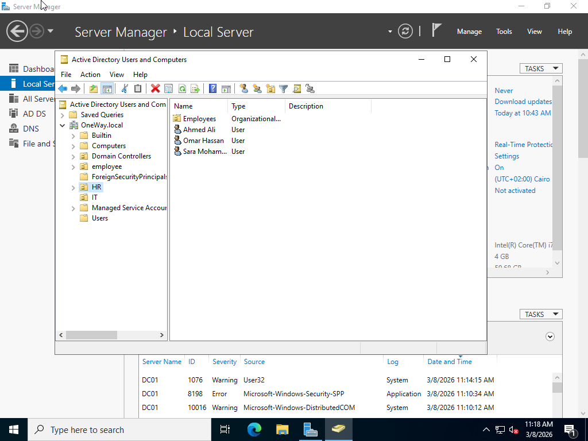
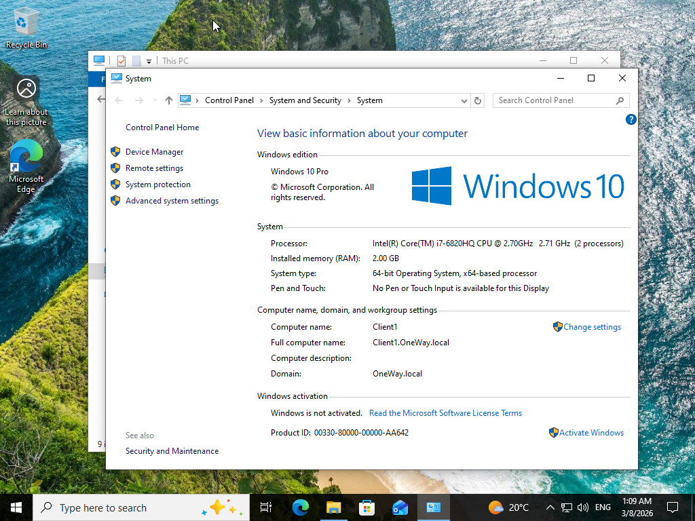
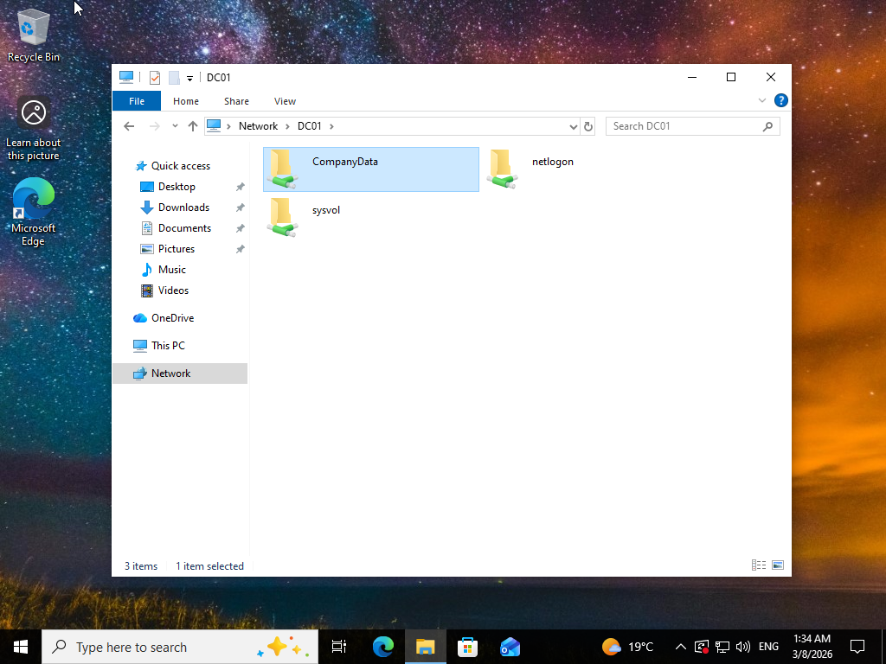

# Active-Directory-Lab
Building a small enterprise lab using Windows Server and Active Directory

## Overview

This project demonstrates building a small enterprise environment using Windows Server.

## Lab Environment

- Windows Server 2022 (Domain Controller)
- Windows Client Machine
- Active Directory Domain Services
- DNS

## Implemented Tasks

- Installed Active Directory
- Created Organizational Units (OU)
- Created Domain Users
- Created Security Groups
- Joined a client machine to the domain
- Configured shared folders with permissions

## Skills Learned

- Active Directory Administration
- Domain Management
- User and Group Management
- DNS Configuration
- File Sharing and Permissions
- 
## Screenshots

### Active Directory Users

### Domain Join

### Shared Folder

